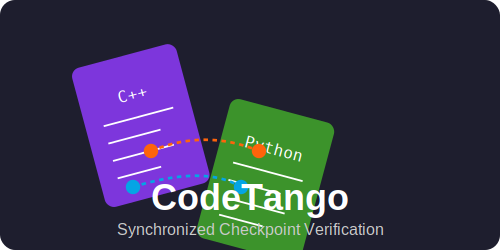

# CodeTango 🕺💃



Synchronous checkpoints server and client API to help LLMs to validate the equality of two programs.

CodeTango is a Linux utility for synchronizing the execution of two different programs at user-defined checkpoints (barriers) and validating that their state variables match at each checkpoint. Like dance partners performing a tango, the two programs move through their execution in lockstep, each mirroring the other's state at critical points.

## Features

- 🔄 **Synchronized Execution**: Ensures both programs reach checkpoints in the same order
- ✅ **State Verification**: Validates variable values match at each checkpoint
- 🌐 **Cross-Language Support**: Works with different programming languages (C++ and Python implementations provided)
- 📊 **Detailed Reporting**: Provides clear reporting of any state differences
- ⚠️ **Error Handling**: Comprehensive timeout and error handling

## When to Use CodeTango

The major usecase for CodeTango is LLMs. Although LLMs are currently very good in program code (re-)writing, they may introduce small bugs that are hard to spot. To make LLM bug hunting easier, we can ask LLM to add CodeTango into original and new program code to perform the following tasks:

- **Algorithm Verification**: Compare different implementations of the same algorithm
- **Refactoring Validation**: Ensure refactored code behaves identically to the original
- **Cross-Language Testing**: Verify consistency between implementations in different languages
- **Parallel Processing Debugging**: Debug synchronization issues in parallel code
- **Numerical Stability Testing**: Check numerical consistency across implementations

## Installation

1. Clone the repository:
   ```bash
   git clone https://github.com/dmikushin/codetango.git
   cd codetango
   ```

2. Install the Python package:
   ```bash
   pip install -e .
   ```

3. Build and install the C++ library:
   ```bash
   cd cpp
   mkdir build && cd build
   cmake ..
   make
   sudo make install
   ```

## Usage

### Control Utility

The main `codetango` command launches and synchronizes two programs:

```bash
codetango [options] program1_cmd [args] program2_cmd [args]
```

Options:
- `--timeout SECONDS`: Set the timeout for waiting at barriers (default: 60)
- `--verbose, -v`: Enable verbose output
- `--help, -h`: Show help message

Example:
```bash
codetango --verbose ./cpp_program 1 -3 2 python3 python_program.py 1 -3 2
```

### C++ Library

Include the header and use the `codetango::Barrier` class:

```cpp
#include <codetango.h>

// In your code
codetango::Barrier barrier("program1");

// Before a checkpoint
barrier.add_int("counter", counter);
barrier.add_double("result", result);
barrier.wait("checkpoint_name");

// Continue execution when both programs have reached this point
```

### Python Library

Import the module and use the `Barrier` class:

```python
from codetango import Barrier

# In your code
barrier = Barrier("program2")

# Before a checkpoint
barrier.add_int("counter", counter)
barrier.add_float("result", result)
barrier.wait("checkpoint_name")

# Continue execution when both programs have reached this point
```

## Adding Checkpoints to Existing Code

To add checkpoints to existing code:

1. Include the appropriate library for your language
2. Create a Barrier instance with a unique program ID
3. At each checkpoint:
   - Register variables you want to compare
   - Call the `wait()` method with a unique checkpoint ID
4. Use the same checkpoint IDs in both programs

## Example: The Dance of Solving a Quadratic Equation

This repository includes example implementations of a quadratic equation solver in both C++ and Python to demonstrate how to use CodeTango.

### Building the C++ Example

```bash
cd examples/cpp
mkdir build && cd build
cmake ..
make
```

### Running the Examples

```bash
codetango --verbose ./cpp_example 1 -3 2 python3 python_example.py 1 -3 2
```

This will produce output showing both programs moving through checkpoints together, like dance partners, with their states being verified at each step.

## How It Works

1. The CodeTango control utility launches both programs
2. Each program registers with the utility via a Unix domain socket
3. When a program reaches a barrier, it sends its state variables to the utility
4. The utility waits for both programs to reach the same barrier
5. Once both arrive, the utility compares their states and reports any differences
6. Both programs are then allowed to continue execution
7. The process repeats for each barrier

## License

This project is licensed under the MIT License - see the LICENSE file for details.
